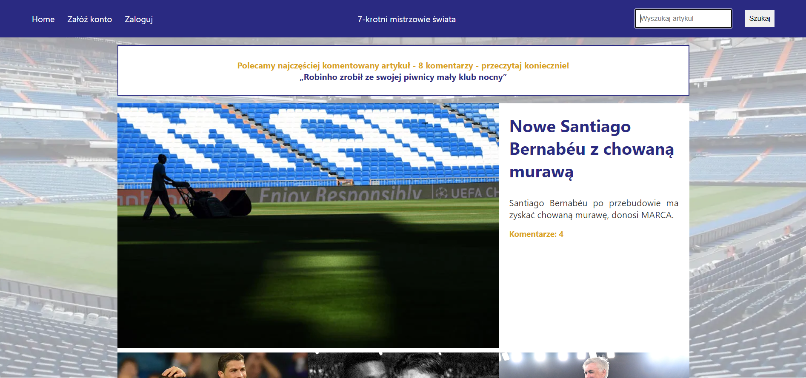
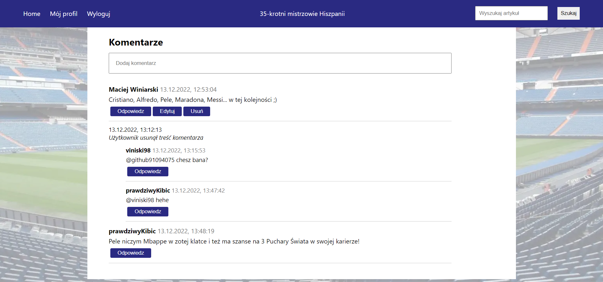
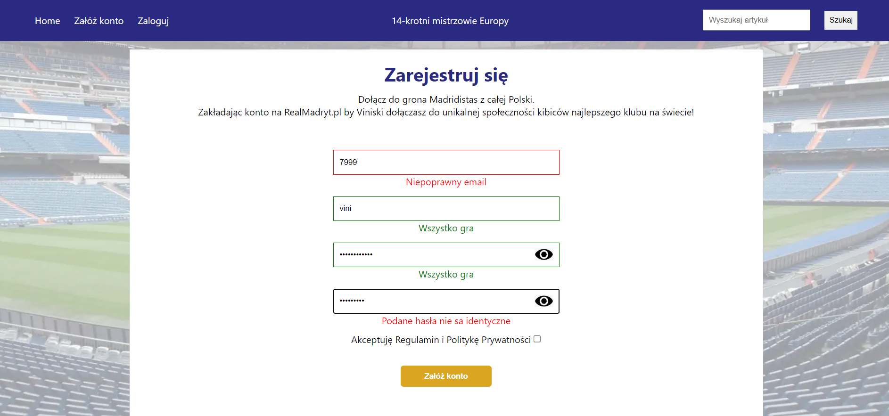
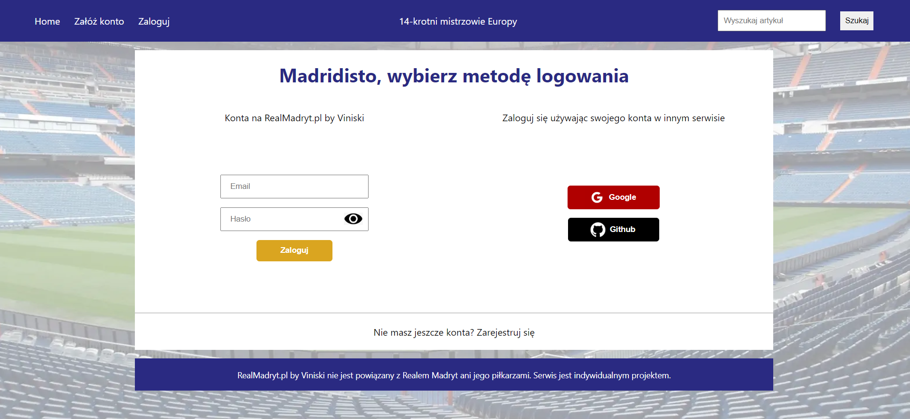

# RealMadryt.pl by Viniski

# FRONT END

Fullstack application inspired by realmadryt.pl. The application front was written using React.js. While the back end was written using Node.js, Express.js and the data was stored in the MongoDB database.

This repository contains the frontend part of the my application. You can find the backend here: https://github.com/Viniski/RealMadryt.pl-by-Viniski-backend

## Descriptions

The application contains several articles, the ability to search them through the search engine placed in the header of the page. You can comment on articles after creating an account or logging in, also using external portals: google and github. Comments can be added, edited, deleted and reply to comments from other users.

## Technical

This project was bootstrapped with Create React App. The Context API was used to manage the state, using additionally useState and useReducer. The design of the application was independently designed. The CSS module was chosen to style the application due to the encapsulation of the CSS classes of the components. The application is adapted to display on screens with different resolutions. Validation of registration and login forms without the use of external libraries has been written. The axios library and the fetch API were used to connect to the API. The routing was built using the react-router library. Environment variables used. I know that the downside is the lack of tests, but I plan to include them in the next project I'm working on.

## :computer: Built With

- React.js
- Create-react-app
- CSS Module
- React-Router
- Axios
- Fetch
- Dotenv
- React-cookie
- React-notification

## Demo

https://realmadrytbyviniski.onrender.com

Render.com cloud application hosting for developers was used. Please be patient while loading due to the free package I'm using.

Unfortunately, after logging in and refreshing the page, you will not be logged in, because the free site I use for deployment is on the public suffix list, which prevents cookies from working properly. Also login via social media does not work for this reason. I encourage you to run the project on your computer, to take advantage of this facility :)

#### If you want running on your computer:

The frontend and backend are separate projects -- first start the backend

```zsh
npm install
node index.js
```

Start the frontend (which is in another repository) in a new terminal

```zsh
npm install
npm run start
```

### Home



### Home (mobile)


### Article (mobile)


### Comment section



### Register Page



### Login Page



## License

This project is licensed under the MIT License.
All texts are the property of realmadryt.pl all photos and images are the property of Getty Images.

# Getting Started with Create React App

This project was bootstrapped with [Create React App](https://github.com/facebook/create-react-app).

## Available Scripts

In the project directory, you can run:

### `npm start`

Runs the app in the development mode.\
Open [http://localhost:3000](http://localhost:3000) to view it in your browser.

The page will reload when you make changes.\
You may also see any lint errors in the console.

### `npm test`

Launches the test runner in the interactive watch mode.\
See the section about [running tests](https://facebook.github.io/create-react-app/docs/running-tests) for more information.

### `npm run build`

Builds the app for production to the `build` folder.\
It correctly bundles React in production mode and optimizes the build for the best performance.

The build is minified and the filenames include the hashes.\
Your app is ready to be deployed!

See the section about [deployment](https://facebook.github.io/create-react-app/docs/deployment) for more information.

### `npm run eject`

**Note: this is a one-way operation. Once you `eject`, you can't go back!**

If you aren't satisfied with the build tool and configuration choices, you can `eject` at any time. This command will remove the single build dependency from your project.

Instead, it will copy all the configuration files and the transitive dependencies (webpack, Babel, ESLint, etc) right into your project so you have full control over them. All of the commands except `eject` will still work, but they will point to the copied scripts so you can tweak them. At this point you're on your own.

You don't have to ever use `eject`. The curated feature set is suitable for small and middle deployments, and you shouldn't feel obligated to use this feature. However we understand that this tool wouldn't be useful if you couldn't customize it when you are ready for it.

## Learn More

You can learn more in the [Create React App documentation](https://facebook.github.io/create-react-app/docs/getting-started).

To learn React, check out the [React documentation](https://reactjs.org/).

### Code Splitting

This section has moved here: [https://facebook.github.io/create-react-app/docs/code-splitting](https://facebook.github.io/create-react-app/docs/code-splitting)

### Analyzing the Bundle Size

This section has moved here: [https://facebook.github.io/create-react-app/docs/analyzing-the-bundle-size](https://facebook.github.io/create-react-app/docs/analyzing-the-bundle-size)

### Making a Progressive Web App

This section has moved here: [https://facebook.github.io/create-react-app/docs/making-a-progressive-web-app](https://facebook.github.io/create-react-app/docs/making-a-progressive-web-app)

### Advanced Configuration

This section has moved here: [https://facebook.github.io/create-react-app/docs/advanced-configuration](https://facebook.github.io/create-react-app/docs/advanced-configuration)

### Deployment

This section has moved here: [https://facebook.github.io/create-react-app/docs/deployment](https://facebook.github.io/create-react-app/docs/deployment)

### `npm run build` fails to minify

This section has moved here: [https://facebook.github.io/create-react-app/docs/troubleshooting#npm-run-build-fails-to-minify](https://facebook.github.io/create-react-app/docs/troubleshooting#npm-run-build-fails-to-minify)
